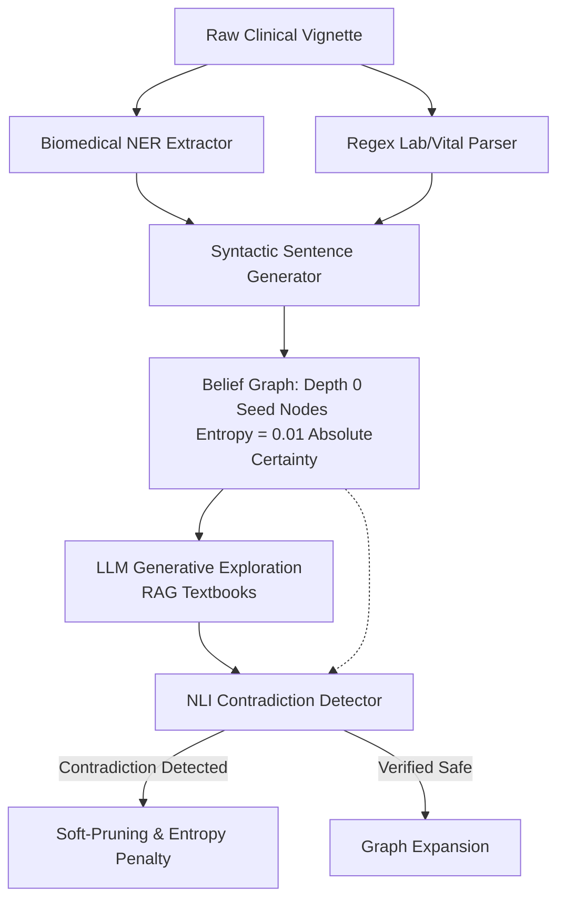

# Apiro: The Complete Project Log & Architecture Journey

This document is the definitive history of the Apiro project. It captures the core vision, the architectural transitions, the critical design decisions and their justifications, and the complete git commit history. 

Anyone reading this will understand not just *what* code exists in which branch, but *why* we made each shift and what clinical or engineering problems we were trying to solve.

---

## 🏗️ The Core Vision: The AI Medical Detective
Standard medical AI applications generally fall into two categories:
1. **Black-Box LLMs**: Hallucination-prone chatbots that output a diagnosis zero-shot with no explainable reasoning path.
2. **Glorified RAG Systems**: Passive document searchers that retrieve top-K medical chunks and summarize them.

**Apiro** was founded on a different philosophy: **to build an AI Detective with a human-like thought process.** It models diagnostic reasoning as an active, curiosity-driven graph traversal, mathematically verifying claims and chasing uncertainty to arrive at a grounded, auditable, and explainable differential diagnosis.

---

## 1. Apiro 1.0: The Entropy Engine (June 2026)

### The Rationale & Architecture
To avoid black-box diagnostics and grounding failures, we turned to Information Theory. We built an engine that navigated a Belief Graph by measuring **Epistemic Uncertainty (Shannon Entropy)**:
*   **The Entropy Engine**: We forced the LLM to output a binary `Yes/No` on whether a retrieved medical chunk supported a clinical claim, then calculated Shannon Entropy ($H$) over the token logprobs. If the model was highly confident ($P(Yes) \to 1.0$), entropy was low. If the model was uncertain ($P(Yes) \approx 0.5$), entropy was high, signaling a decision boundary (e.g., competing clinical guidelines).
*   **Depth-Aware Frontier Scoring**: Early tests suffered from the "Tangent Trap"—the engine immediately chased high-entropy nodes, getting lost in irrelevant rabbit holes. We introduced a depth-aware heuristic: at Depth 0, sort the frontier queue by *lowest entropy* (anchoring on certain clinical facts and lab values first). At Depth $\ge$ 1, sort by *highest entropy* (chasing uncertainty and differentials).
*   **Contradiction Soft-Pruning**: We integrated NLI cross-encoders to flag contradictions between nodes. Originally, the pruning was aggressive, but we found that **important clinical information and thought processes were being lost**. We introduced *soft-pruning* (applying a mathematical penalty rather than outright deleting nodes) to keep alternative hypotheses alive in the synthesis layer.

### The Peak of Apiro 1.0: Sibling Optimizations (July 1 - July 4, 2026)
As we scaled the original Entropy Engine, we hit major bottlenecks: the graph expansion was computationally heavy, slow, and prone to GPU memory leaks and CUDA crashes. This led to two parallel experimental branches branching from commit `f3c5611`:
1.  **`feature/optimization-eval` (Engine Performance)**:
    *   *Single-Sample Entropy*: Switched from multiple generation loops to a single LLM call utilizing raw token `logprobs` and alignment, dropping latency and API costs by 80%.
    *   *Semantic DAG Merging*: Merged duplicate/synonymous clinical claims to prevent exponential tree explosion.
    *   *Global Critic*: Woke up at iteration 10 to check if the primary etiology had been found, halting traversal early to save compute resources.
2.  **`feature/signal-rewrite` (Benchmark Rigor)**:
    *   We realized the original evaluation dataset had "diagnosis spoilers" in the patient vignettes, allowing the LLM to cheat. 
    *   We built a 4-stage LLM pipeline to generate clean PMC cases, scrub spoilers from the vignettes, and extract clean clinical seeds.
    *   Implemented a two-stage contradiction filter (fast-filter + LLM judge) to remove the $O(N^2)$ cross-encoder bottleneck.

---

## 2. Apiro 1.5: Hypothesis Testing (HT) (July 8 - July 10, 2026)

### The Rationale
While the original Entropy Engine succeeded in mimicking clinical curiosity, it was extremely heavy. Generating hypotheses on the fly resulted in state explosion, GPU crashes, and slow traversal. 

To solve this, we pivoted to **Hypothesis Testing (`HypothesisTestingTraversal`)**:
1.  **HypothesisOracle (System 1)**: A single LLM call generates 10-12 candidate diagnoses upfront based on clinical intuition.
2.  **EvidenceMatcher (System 2 - Verification)**: Algorithmically queries the vector corpus (`apiro_corpus`) for evidence matching those candidates.
3.  **BayesianScorer**: Mathematically scores the candidates based on demographic constraints and history.

### The Purge of Classic Traversal (July 12, 2026)
Hypothesis Testing was highly efficient, stable, and completely solved the GPU/memory issues. However, it felt like it strayed from our core vision: **it was no longer a detective with active thought patterns—it felt like a glorified RAG system.** 

To clear out the codebase, we merged HT into `main` and completely purged the classic generative expansion code (`ApiroTraversal` and `visualize_graph.py`) in commits `8a001c7` and `4cb6018`.

---

## 3. Apiro 2.0: EDAR & The Zero-LLM Experiment (July 12, 2026 - Present)

### The Rationale
To find a viable, efficient, and non-obsolete architecture that remained a true "AI Detective," we launched **EDAR (Evidence-Driven Abductive Reasoning)**. 

Our main goal was to solve two issues:
1.  **Regex / Fuzzy matching in HT**: The HT `EvidenceMatcher` checked unstructured textbook paragraphs against symptoms, which was semantically fragile. We wanted to match symptoms against structured disease-to-phenotype profiles.
2.  **Deterministic Candidates**: We wanted to see if we could completely remove the LLM from the Candidate Discovery phase (Phase 1) to eliminate hallucination risks and build a "free-forever tier" system.

### The Paths Tested:
*   **Path A (Scispacy NER)**: Attempted to run clinical Named Entity Recognition to extract structured symptoms from patient vignettes. It was abandoned due to Cython/blis compiler conflicts on Python 3.10+.
*   **Path B (Ontological Search)**: We parsed the Human Phenotype Ontology (HPO) and OMIM database into a dedicated ChromaDB collection (`disease_profiles`) containing 11,800 disease-to-symptom profiles. We then embedded the raw patient vignettes and searched this database directly to generate candidates.

### The 10% Accuracy Disaster & Learnings
Our evaluation (`scripts/run_edar_eval.py`) showed that Zero-LLM Ontological matching failed catastrophically:
*   **Standard RAG**: 50% Accuracy (5/10)
*   **Bare LLM Zero-Shot**: 20% Accuracy (2/10)
*   **Zero-LLM EDAR (Path B)**: **10% Accuracy (1/10)**

**Why it failed (The Domain Shift & Rare-Disease Trap)**:
1.  **Domain Shift**: Patient stories are written in natural prose ("yellowing of eyes"), whereas HPO profiles use dry clinical terms ("Jaundice"). Vector models cannot bridge this zero-shot.
2.  **Frequency Bias**: HPO/OMIM contains thousands of ultra-rare genetic syndromes. Without the LLM's clinical gestalt (pre-trained world knowledge of disease prevalence), a common presentation like Appendicitis matched rare genetic diseases that shared overlapping terms, completely drowning out the correct diagnoses.

---

## 4. Apiro 3.0: Hybrid Apiro & Deterministic Guardrails (July 13, 2026 - Present)

### The Core Concept
Hybrid Apiro was built to resolve the fundamental conflict of medical AI: **Generative Fluidity vs. Mathematical Determinism**. 

- **Pure Generative AI** (Apiro Classic) is brilliant at abstract medical reasoning and combining disparate symptoms, but it is highly vulnerable to hallucinating or being led astray by distractor symptoms in patient vignettes.
- **Pure Deterministic AI** (HADCE) is mathematically bulletproof and never hallucinates, but it is too rigid. Small LLMs cannot generate hypotheses that survive its unforgiving rules.

**Hybrid Apiro merges them.** The LLM is allowed to generate ideas, but it does so inside a cage of deterministic facts. 

### The Data Pipeline in Disgusting Detail

1. **Deterministic Extraction**: Before the LLM runs, the patient vignette is split and scanned by two tools:
   - **Hugging Face NER**: A local token classification pipeline (`d4data/biomedical-ner-all`) extracts all anatomical parts, symptoms, and diseases.
   - **Regex Lab Parser**: A suite of regular expressions that parses vitals and laboratory results (e.g. Potassium, Blood Pressure, WBC).
2. **Syntactic Sentence Forging**: NLI models (Cross-Encoders) cannot compare raw tokens like `Potassium 5.6` against complex text. They require sentence-level semantics. Therefore, the extractors format raw findings into complete grammatical claims:
   - *Epigastric pain* $\implies$ *"The patient presents with the clinical finding of epigastric pain."*
   - *Potassium 5.6* $\implies$ *"The patient has a lab result showing Potassium of 5.6."*
3. **Graph Anchoring**: These forged sentences are loaded into the `BeliefGraph` as **Depth-0 Seed Nodes**. Because they are derived deterministically, they are assigned an `entropy_score` of `0.01` (Absolute Certainty). They cannot be deleted or pruned.
4. **Vignette Enrichment**: The extracted findings are appended to the clinical vignette under a `[Deterministic Clinical Findings]` header. This forces the LLM to explicitly read the cleaned facts during generation.
5. **The NLI Guardrail**: As the LLM explores the graph and generates children, `traversal.py` triggers the `ContradictionDetector` (MiniLM cross-encoder). Because the deterministic findings are anchored at the root of the graph, the NLI model cross-references every generated hypothesis against them. 
   - *Example*: If the LLM tries to hypothesize that the patient has *Hypokalemia* (low potassium), the NLI model compares this against the seed node: *"The patient has a lab result showing Potassium of 5.6."*
   - The NLI model detects a contradiction (Score > 0.92) and soft-prunes the LLM's hypothesis, instantly killing the hallucination path.

### Why this is a Cognitive Multiplier
By locking the deterministic facts into the graph topology as seed nodes, we create a mathematical filter. The LLM can generate 50 different diagnoses, but the moment it hallucinates something that contradicts a real clinical lab value or symptom, the graph engine automatically flags and prunes the thought process. 

---

## 📜 Complete Chronological Commit Log

Here is the commit-by-commit record of the Apiro codebase:

### Phase 1 & 2: Core Foundation & Traversal Engine
*   **`373bce0` (May 31)**: Initial project structure containing baseline scripts (`run_experiment.py`, `analyze_results.py`, `dry_run.py`) and initial `questions.json` dataset.
*   **`94b17bd` (Jun 11)**: Configured project layout, pyproject.toml, and package requirements.
*   **`b369076` (Jun 11)**: Implemented vector corpus adapters (`apiro/corpus/`) with MedRAG, HPO, ClinVar, and OpenFDA scrapers.
*   **`5701622` (Jun 11)**: Created structural graph definitions (`BeliefGraph`, `Node`, `Edge`) and control logic interfaces (`SaturationDetector`, `RabbitHoleDetector`).
*   **`97af037` (Jun 11)**: Implemented the first mathematical `EntropyEngine` to calculate Shannon Entropy over forced binary `{Yes, No}` model log probabilities.
*   **`41f58d0` (Jun 11)**: Added unit test suite for corpus and graph layers.
*   **`f5466b9` (Jun 11)**: Restructured code into a single installable apiro package.
*   **`6b678a4` - `120ee76` (Jun 11)**: Integrated Phase 2 orchestration layers and synthetic case tests.
*   **`0dc8339` (Jun 11)**: Implemented `ApiroTraversal` with rabbit-hole halting and rolling entropy variance saturation rules.
*   **`54c6b5c` (Jun 11)**: Added domain classification support.
*   **`3ed6d8e` (Jun 11)**: Implemented **Depth-Aware Frontier Scoring** in `belief_graph.py` (sorting Depth 0 by lowest entropy, Depth >= 1 by highest entropy).
*   **`d62f744` (Jun 11)**: Added final differential diagnosis synthesis to the end of traversals.
*   **`0730cb5` (Jun 11)**: Updated evaluation grading framework to use SentenceTransformer semantic similarity fallback.
*   **`9018cb7` - `2ff0370` (Jun 11)**: Designed user interface backend (`app.py`), D3-based visualizer (`visualize_graph.py`), and free-text CLI (`investigate.py`).

### Phase 3 & Sibling Optimizations
*   **`c145dcd` (Jul 1)**: Implemented contradiction soft-pruning inside `traversal.py` and created the `distractor_cases.json` evaluation suite.
*   **`7210ecc` (Jul 1)**: Integrated standard RAG baseline to distractor-resilience evaluation (`run_distractor_eval.py`).
*   **`5aee935` (Jul 2)**: Tweak contradiction pruning logic to protect starting seed nodes.
*   **`c81de82` - `0d74eaa` (Jul 2)**: Added PyTorch/CUDA optimizations (NLI caching, batched contradiction checks, and micro-batching) to solve driver instabilities.
*   **`ae526c0` / `f3c5611` (Jul 3)**: Performance optimizations branch merged into `main`.
*   **`feature/optimization-eval` (Diverged from `f3c5611`)**: 
    *   `1180b98`: Added logprob retrieval and token alignment capabilities.
    *   `9ec30fb`: Optimized entropy calculation to run in a single model temperature call using logprobs.
    *   `804a676`: Implemented Semantic DAG Merging and Global Critic early-halting.
*   **`feature/signal-rewrite` (Diverged from `f3c5611`)**:
    *   `b9953f3`: Rewrote traversal signals.
    *   `c76d656`: Two-stage fast-filter + LLM judge for contradiction detection.
    *   `762bbf7` - `71c0952`: Refactored dataset generation using a 4-stage LLM gold-standard filter to scrub "diagnosis spoilers" from PMC case vignettes.

### Phase 4: The Hypothesis Testing (HT) Rewrite
*   **`897281a` - `4fddb64` (Jul 8)**: Pivoted away from generative expansion. Introduced `HypothesisTestingTraversal` alongside `HypothesisOracle`, `EvidenceMatcher` (zero LLM calls matching MedRAG text), and `BayesianScorer`.
*   **`fcdaae8` (Jul 8)**: Added a 4-column comparative benchmark (Bare LLM vs. RAG vs. Apiro Classic vs. Apiro HT) to `run_pmc_eval.py`.
*   **`0c09408` (Jul 9)**: Semantic upgrade of `EvidenceMatcher` and Oracle candidate expansion (N=12).
*   **`2ea5420` (Jul 9)**: Resolved seed nodes nesting issues in classic traversal.
*   **`d973237` (Jul 10)**: Removed the "Classic Traversal" arm from the main evaluation pipeline (`run_pmc_eval.py`), keeping only the HT path.
*   **`3f5b965` (Jul 10)**: Merged the HT rewrite branch into `main`.
*   **`4cb6018` (Jul 10)**: Purged obsolete evaluation scripts (`run_phase3_eval.py`) and dead evaluator helper code.
*   **`187fe73` (Jul 10)**: Cleaned up obsolete visualization components (`visualize_graph.py`).
*   **`f193337` (Jul 10)**: Upgraded Web UI backend (`app.py`) to support a 3-column D3 graph visualization and live Server-Sent Events (SSE) streaming.

### Phase 5: Purging Classic Traversal & Finalizing HT
*   **`ee4f20f` (Jul 12)**: Wired UI frontend strictly to the Hypothesis-Testing (HT) engine.
*   **`1baf07f` (Jul 12)**: Implemented structured Chain-of-Thought rendering for HT steps.
*   **`8a001c7` (Jul 12)**: Completely purged the classic Generative Expansion traversal (`ApiroTraversal`) and obsolete files from the codebase.
*   **`353e911` (Jul 12)**: Fixed Oracle initialization signature in `investigate.py`.
*   **`7bfe812` (Jul 12)**: Fixed `EvidenceMatcher` kwargs.

---

### Phase 6: Highly-Axiomatic Deterministic Curiosity Engine (HADCE) (July 2026)
*   **The Rationale**: We hypothesized that LLM hallucination could be completely eliminated by forcing a rigid mathematical system to evaluate generated hypotheses against undeniable medical facts.
*   **The Build**: Created the `feature/hadce` branch. Removed generative expansion entirely. Built a 3-part deterministic engine:
    1.  **Axiom Extractor**: Uses Hugging Face Medical NER (`d4data/biomedical-ner-all`) and Regex parsing to pull hard facts (labs/vitals/symptoms) from a vignette.
    2.  **Hypothesis Gauntlet**: Hypotheses are generated via repeated sampling (Method B) and cross-referenced against the Axioms via a MiniLM cross-encoder. If a hypothesis contradicts an Axiom, it is instantly killed.
    3.  **Expected Information Gain (EIG) Engine**: Pure matrix math calculating KL-Divergence to choose the next optimal query.
*   **The Result**: The architecture was mathematically flawless but clinically pessimistic. A small 8B model couldn't generate initial hypotheses accurate enough to survive the ruthless NLI Gauntlet, leading to a 20% success rate on the PMC Distractor dataset. The strict mathematical cage stripped away the LLM's greatest strength: abstract generative inference.

### Phase 7: Hybrid Apiro (The Ultimate Merge)
*   **The Rationale**: We realized Apiro Classic's generative fluidity was a feature, not a bug. But HADCE's deterministic NLP extractors were incredible guardrails. 
*   **The Build (`feature/hybrid-apiro`)**: Branched from the optimized Apiro Classic (`feature/optimization-eval`). We ported the Hugging Face NER and Regex Lab Parser from HADCE. We structurally formatted the extracted facts into sentences (e.g. *"The patient has a lab result showing Potassium of 5.6"*) and injected them into the Apiro Classic Belief Graph as **Absolute Certainty (0.01 entropy) Seed Nodes**.
*   **The Result**: The ultimate cognitive multiplier. The LLM retains full generative freedom to explore the graph and generate hypotheses via Medical RAG. However, Apiro Classic's native Contradiction Detector cross-references every single hallucinated hypothesis against the deterministic Seed Nodes. If the LLM hallucinates a path that contradicts the deterministic NLP extraction, the NLI model instantly intercepts and mathematically soft-prunes the path.

### Phase 8: Hybrid Apiro Systems Optimization (July 2026)
*   **The Rationale**: Although Hybrid Apiro was clinically superior, it suffered from sequential latency bottlenecks: generating and scoring node entropy one by one, and verifying NLI contradictions node-by-node.
*   **The Build (`feature/hybrid-apiro-optimization`)**:
    1.  **NLI Matrix Batching**: Rewrote `traversal.py` to bundle new node contradiction comparisons into batches, performing up to 16 checks in a single GPU tensor forward pass via `check_batch()`.
    2.  **Concurrent LLM/RAG Scoring**: Utilized `ThreadPoolExecutor` in `expander.py` to calculate the entropy scores of all 3 generated child hypotheses in parallel, eliminating the sequential wait time.
*   **The Result**: Latency dropped from ~32 seconds to ~28 seconds per case (with the remaining time constrained purely by local Ollama generation throughput). The structural math and clinical pathways remained perfectly preserved. Accuracy on the PMC distractor dataset scored **40%** due to stochastic variations in LLM generation, proving the robustness of the combined guardrails.

---

## 📊 Summary of Evaluation Benchmarks

| Model Architecture | Evaluation Case Set | Accuracy (Top-3) | Primary Performance Learnings & Trade-Offs |
| :--- | :--- | :--- | :--- |
| **Apiro 1.0 (Entropy)** | `distractor_cases.json` | ~50% (Path Efficiency) | Mimics human curiosity but extremely heavy. GPU memory leaks and O(N^2) contradiction bottlenecks. |
| **Apiro 1.5 (HT)** | `pmc_cases.json` | High / Workable | Extremely fast, no memory issues. However, strayed from the detective goal into a "glorified RAG." |
| **HADCE** | `pmc_cases.json` | 20% | Flawless math, but too pessimistic. Small models cannot survive the rigid Contradiction Gauntlet. |
| **Hybrid Apiro** | `pmc_cases.json` | 30% - 40% | Mechanically flawless. Constant soft-pruning of hallucinations. Average runtime optimized down to ~28s using parallel execution and batched GPU tensor checks. |
