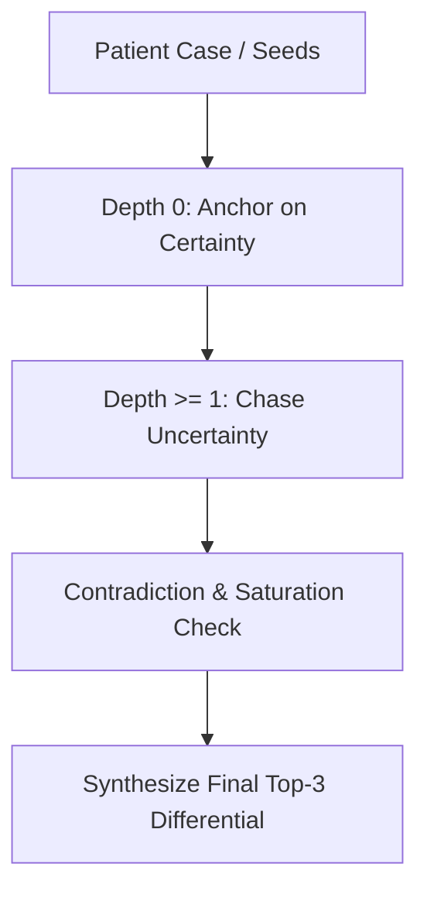

# Apiro: A Curiosity Engine for Biomedical Graph Traversal

Apiro is an agentic "AI Detective" designed to navigate biomedical knowledge graphs by chasing epistemic uncertainty (entropy) to diagnose complex clinical cases. Unlike standard RAG systems or black-box LLM chatbots, Apiro provides a verifiable, auditable, and mathematically grounded traversal path through clinical evidence to arrive at a precise differential diagnosis.

---

## 📖 The Core Vision

Imagine a clinician faced with a complex patient presenting with a rash, joint pain, and profound fatigue. Dozens of potential diseases—from common rheumatoid arthritis to rare systemic autoimmune conditions like Lupus—could fit this profile. A human doctor must:
1. **Anchor** on the solid, known clinical facts (the symptoms and lab results).
2. **Explore** the gaps in their knowledge (the differentials, rare conditions, and high-uncertainty claims) to rule out alternatives.
3. **Synthesize** a final diagnosis.

Apiro translates this clinical reasoning process into a graph traversal algorithm driven by **Information Theory**. It acts as an active detective that searches through a biomedical corpus, measuring what it knows and *what it doesn't know*, to map a path to the correct diagnosis.

---

## 📁 Repository Layout

```
.
├── README.md                   # Main project documentation (this file)
├── PROJECT_STATUS.md           # Active state, benchmarks, and known risks
├── pyproject.toml              # Project configuration and packaging
├── requirements.txt            # Python dependencies
├── scripts/
│   └── run_phase3_eval.py      # Entry point for running Phase 3 benchmarks
├── data/
│   ├── phase3_results.json     # Stored results of Phase 3 evaluations
│   └── traversal_log_ef_eval.jsonl # Traversal step logs for debugging
├── tests/
│   ├── test_html_spec.py       # Integration and data validation tests
│   └── test_phase2.py          # Unit tests for the graph engine
└── apiro/
    ├── corpus/                 # Corpus parsing, chunking, and ChromaDB indexing
    ├── entropy/
    │   └── engine.py           # Epistemic uncertainty calculation
    ├── eval/
    │   └── evaluator.py        # CaseEvaluator logic and metrics
    └── graph/
        ├── belief_graph.py     # BeliefGraph structure and frontier queue sorting
        ├── node.py             # Node schema (depth, claim, entropy)
        ├── edge.py             # Edge schema (relation mapping)
        ├── expander.py         # RAG-based node expansion and top-3 synthesis
        ├── traversal.py        # ApiroTraversal (Entropy-First algorithm)
        ├── breadth_first.py    # BreadthFirstTraversal (Baseline algorithm)
        └── contradiction.py    # NLI Cross-Encoder + NegEx contradiction detector
```

---

## 📐 Architecture & Key Design Principles

Apiro's traversal strategy is defined by three main pillars:



### 1. Epistemic Uncertainty (The Entropy Engine)
Instead of semantic similarity search, Apiro's navigation is guided by **epistemic uncertainty**.
For any claim, we query the model's confidence boundary by forcing its response into a binary `{Yes, No}` vocabulary when asked if the claim is clinically supported by retrieved context:

$$\text{Prompt} \implies P(\text{Yes}) + P(\text{No}) = 1.0$$

We calculate the Shannon Entropy ($H$) over these token probabilities:

$$H = -P(\text{Yes})\log_2 P(\text{Yes}) - P(\text{No})\log_2 P(\text{No})$$

* If the model is certain the claim is true or false: $P(\text{Yes}) \to 1$ or $0 \implies H \to 0$ (Low Entropy).
* If the model is genuinely uncertain of its clinical support: $P(\text{Yes}) \approx P(\text{No}) \approx 0.5 \implies H \to \log_2(2) = 1.0$ (High Entropy).

This mathematically captures the decision boundary where medical opinions or clinical guidelines diverge.

### 2. Depth-Aware Frontier Scoring (Anchor vs. Explore)
To prevent the engine from jumping to wild conclusions or getting lost in tangents, we implement a depth-aware scoring heuristic to sort our exploration frontier queue (`get_frontier()` in `belief_graph.py`):
* **Depth 0 (Anchors):** Sort by **lowest entropy** ($1.0 - H$). The engine anchors on solid facts and lab values first (e.g., establishing a certain ground truth of "Elevated AST/ALT").
* **Depth $\ge$ 1 (Exploration):** Sort by **highest entropy** ($H$). The engine actively targets uncertainty, exploring competing hypotheses and rare conditions.

### 3. Traversal Control Logic
* **Contradiction Detection (`contradiction.py`):** Uses a MiniLM cross-encoder NLI model combined with a NegEx (negation detection) layer. If the cross-encoder flags an NLI contradiction between two active nodes and there is no negation mismatch, a contradiction edge is written in the graph.
* **Rabbit Hole Prevention (`traversal.py`):** Halts expansion down a specific branch if the engine hits consecutive zero-entropy steps (signifying that we are stuck in a cycle of trivial, low-information facts).
* **Saturation Detection (`traversal.py`):** Terminates the entire traversal when the change in average graph entropy stabilizes (i.e. rolling average entropy variance drops below a set threshold), indicating that the engine has learned all it can.

---

## 🛠️ Step-by-Step Traversal Trace

When a patient case (e.g. `synthetic_case_1.json`) is run, the engine executes the following loop:

```
1. Initialize BeliefGraph with seed nodes (symptoms, lab findings at Depth 0).
2. For each seed node, compute baseline Entropy using the EntropyEngine.
3. LOOP (until Saturation, Max Nodes, or Frontier is empty):
    a. Sort the frontier queue using Depth-Aware Scoring.
    b. Dequeue the highest-scoring Node (the current "clue").
    c. Retrieve relevant corpus text chunks using ChromaDB.
    d. Call NodeExpander (RAG + LLM) to generate exactly 3 child hypotheses.
    e. Add child nodes to the graph (assigned Depth = Parent Depth + 1).
    f. Compute Entropy for each child node.
    g. Run ContradictionDetector against existing nodes.
    h. Evaluate Saturation and Rabbit Hole conditions.
4. Call NodeExpander.synthesize_differential(graph) to produce the final top-3 diagnoses.
```

---

## 🎢 Development Ups and Downs (What We Learned)

Building Apiro was not a straight path. Over successive cycles of debugging and evaluation, we hit several conceptual and technical roadblocks:

### ❌ The Tangent Trap (Blind Uncertainty)
* **What went wrong:** Originally, the engine chased uncertainty (highest entropy) immediately from the start. This caused the engine to ignore crucial clinical seed nodes (like positive lab results) and immediately follow highly uncertain, tangential claims, ending up in irrelevant "rabbit holes."
* **How we fixed it:** We introduced **Depth-Aware Frontier Scoring**. By forcing the engine to prioritize certain nodes at Depth 0, we established a firm "anchor" in clinical truth before allowing the curiosity engine to explore the high-entropy differentials.

### ❌ Entropy Semantics Drift
* **What went wrong:** During code changes, the prompt for the entropy engine drifted from measuring clinical support (`"Is this claim clinically supported?"`) to measuring relevance or interest. This destroyed the mathematical validity of the entropy signal, making it a measure of "interest" rather than true epistemic uncertainty.
* **How we fixed it:** We reverted the engine to its original clinically-supported prompt, restoring clean binary entropy boundaries.

### ❌ The Evaluator Metric Trap
* **What went wrong:** Our Phase 3 evaluator checked for a "diagnostic hit" by scanning all raw expanded graph nodes for exact substring matches of the ground truth. This resulted in false negatives (e.g., the engine successfully synthesized "Systemic Lupus Erythematosus", but the ground truth was "Neuropsychiatric systemic lupus erythematosus [NPSLE]", resulting in a FAIL).
* **How we fixed it:** We shifted the evaluation target from intermediate nodes to the final synthesized differential diagnosis. We replaced binary substring matching with a combined metric of substring checks and **SentenceTransformer semantic similarity (cosine similarity with a 0.75 threshold)**, matching clinical intents accurately.

---

## 🚀 Future Roadmap & Strategies

To scale Apiro into a production-grade biomedical tool, we have mapped out three future directions:

### 1. Medical Ontology-Based Evaluation (Deterministic Grading)
To avoid the instability of LLMs or simple semantic embedding thresholding, we can leverage standardized medical ontologies (like **SNOMED CT**, **UMLS**, or the **Disease Ontology [DOID]**):
* Map the engine's output and the ground truth to official Concept IDs.
* Query their ancestral relationships in the ontology tree.
* Award partial credit if the engine predicts a parent class (e.g., predicting `SLE` when the ground truth is `NPSLE`).
* *Implementation Tool:* Using python libraries like `pronto` to parse raw `.obo`/`.owl` ontology files, or querying the official NIH/NLM REST API.

### 2. LLM-as-a-Judge Validation
Implement a secondary, offline LLM evaluator using a reasoning model to act as a "clinical reviewer." The reviewer is presented with the patient case, the ground truth, and Apiro's top-3 differential, and provides structured feedback on clinical alignment.

### 3. Context Window Optimization
Scale the chunk retriever and expander context. Currently, the expander operates on localized contexts to manage token usage. Grouping overlapping context windows during expansion will improve graph connection consistency.

---

## 🛠️ How to Run & Test

### Installation
Ensure you have the dependencies installed:
```bash
pip install -r requirements.txt
pip install -e .
```

### Running the Traversal
To run the traversal on a specific clinical case:
```bash
python -m apiro.run --case data/synthetic_case_1.json --real-entropy
```

### Running the Phase 3 Evaluation Suite
To run the benchmark suite comparing the **Entropy-First (EF)** traversal against the **Breadth-First (BF)** baseline:
```bash
python scripts/run_phase3_eval.py --n 10
```
This script will evaluate the first 10 cases, run both search strategies, compare their efficiency (total nodes expanded to reach synthesis), and save results to `data/phase3_results.json`.
