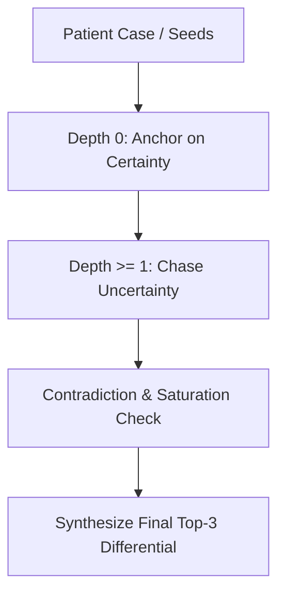

# Apiro: A Curiosity Engine for Biomedical Graph Traversal

Apiro is an agentic "AI Detective" designed to navigate biomedical knowledge graphs by chasing epistemic uncertainty (entropy) to diagnose complex clinical cases. Unlike standard RAG systems or black-box LLM chatbots, Apiro provides a verifiable, auditable, and mathematically grounded traversal path through clinical evidence to arrive at a precise differential diagnosis.

This document serves as the primary **onboarding and contributor guide** for anyone joining the project.

---

## 📖 The Core Vision

Imagine a clinician faced with a complex patient presenting with a rash, joint pain, and profound fatigue. Dozens of potential diseases—from common rheumatoid arthritis to rare systemic autoimmune conditions like Lupus—could fit this profile. A human doctor must:
1. **Anchor** on the solid, known clinical facts (the symptoms and lab results).
2. **Explore** the gaps in their knowledge (the differentials, rare conditions, and high-uncertainty claims) to rule out alternatives.
3. **Synthesize** a final diagnosis.

Apiro translates this clinical reasoning process into a graph traversal algorithm driven by **Information Theory**. It acts as an active detective that searches through a biomedical corpus, measuring what it knows and *what it doesn't know*, to map a path to the correct diagnosis.

---

## 📁 Repository Layout & File Responsibilities

```
.
├── README.md                   # Onboarding, architecture, and developer guide
├── PROJECT_STATUS.md           # Active state, benchmarks, and known risks
├── DEVELOPER_NOTES.md          # File classification map (production vs debug), cleanup, and configs
├── pyproject.toml              # Project configuration and packaging
├── requirements.txt            # Python dependencies
├── scripts/
│   ├── app.py                  # FastAPI web server and UI backend
│   ├── investigate.py          # Free-text clinical CLI detective tool
│   ├── run_phase3_eval.py      # Entry point for running Phase 3 benchmarks
│   └── visualize_graph.py      # D3.js force-directed graph generator
├── data/
│   ├── phase3_results.json     # Stored results of Phase 3 evaluations
│   └── traversal_log_ef_eval.jsonl # Traversal step logs for debugging
├── tests/
│   ├── test_html_spec.py       # Integration and data validation tests
│   └── test_phase2.py          # Unit tests for the graph engine
└── apiro/
    ├── corpus/                 # Corpus parsing, chunking, and ChromaDB adapters
    ├── entropy/
    │   └── engine.py           # Epistemic uncertainty calculation
    ├── eval/
    │   └── evaluator.py        # CaseEvaluator logic and metrics
    └── graph/
        ├── belief_graph.py     # BeliefGraph structure and frontier queue sorting
        ├── node.py             # Node schema (depth, claim, entropy)
        ├── edge.py             # Edge schema (relation mapping)
        ├── expander.py         # RAG-based node expansion and top-3 synthesis (includes hybrid domain classifier)
        ├── traversal.py        # ApiroTraversal (Entropy-First algorithm)
        ├── breadth_first.py    # BreadthFirstTraversal (Baseline algorithm)
        └── contradiction.py    # NLI Cross-Encoder + NegEx contradiction detector
```

---

## 📐 Architecture & Key Design Principles

Apiro's traversal strategy is defined by three main pillars:



### 1. Epistemic Uncertainty (The Entropy Engine)
Instead of semantic similarity search, Apiro's navigation is guided by **epistemic uncertainty**.
For any claim, we query the model's confidence boundary by forcing its response into a binary `{Yes, No}` vocabulary when asked if the claim is clinically supported by retrieved context:

$$\text{Prompt} \implies P(\text{Yes}) + P(\text{No}) = 1.0$$

We calculate the Shannon Entropy ($H$) over these token probabilities:

$$H = -P(\text{Yes})\log_2 P(\text{Yes}) - P(\text{No})\log_2 P(\text{No})$$

* If the model is certain the claim is true or false: $P(\text{Yes}) \to 1$ or $0 \implies H \to 0$ (Low Entropy).
* If the model is genuinely uncertain of its clinical support: $P(\text{Yes}) \approx P(\text{No}) \approx 0.5 \implies H \to \log_2(2) = 1.0$ (High Entropy).

This mathematically captures the decision boundary where medical opinions or clinical guidelines diverge.

### 2. Depth-Aware Frontier Scoring (Anchor vs. Explore)
To prevent the engine from jumping to wild conclusions or getting lost in tangents, we implement a depth-aware scoring heuristic to sort our exploration frontier queue (`get_frontier()` in `belief_graph.py`):
* **Depth 0 (Anchors):** Sort by **lowest entropy** ($1.0 - H$). The engine anchors on solid facts and lab values first (e.g., establishing a certain ground truth of "Elevated AST/ALT").
* **Depth $\ge$ 1 (Exploration):** Sort by **highest entropy** ($H$). The engine actively targets uncertainty, exploring competing hypotheses and rare conditions.

### 3. Hybrid Deterministic Guardrails (Phase 5)
To prevent the generative LLM from hallucinating paths that ignore concrete clinical findings, Apiro uses a **Hybrid Pre-processing Pipeline**:
* **Medical NER:** A Hugging Face PyTorch token classifier (`d4data/biomedical-ner-all`) extracts all deterministic clinical findings from the vignette.
* **Regex Lab Parser:** Hardcoded heuristics parse lab results and vitals (e.g., Potassium, Blood Pressure) to prevent the LLM from making math errors on threshold values.
These extracted findings are syntactically formatted and injected into the Belief Graph as **Absolute Certainty (0.01 entropy) Seed Nodes**. 

### 4. Traversal Control Logic
* **Contradiction Detection (`contradiction.py`):** Uses a MiniLM cross-encoder NLI model. When the LLM explores the graph and generates a new hypothesis, the built-in Contradiction Detector automatically cross-references it against every other node in the graph. If a hallucinated path contradicts one of the deterministic Seed Nodes (e.g. suggesting *Hypokalemia* when the Lab Parser seeded *Potassium 5.6*), the NLI model intercepts and mathematically soft-prunes it!
* **Rabbit Hole Prevention (`traversal.py`):** Halts expansion down a specific branch if the engine hits consecutive zero-entropy steps (signifying that we are stuck in a cycle of trivial, low-information facts).
* **Saturation Detection (`traversal.py`):** Terminates the entire traversal when the change in average graph entropy stabilizes (i.e. rolling average entropy variance drops below a set threshold), indicating that the engine has learned all it can.

---

## 🛠️ Step-by-Step Traversal Trace

When a patient case (e.g. `synthetic_case_1.json`) is run, the engine executes the following loop:

```
1. Initialize BeliefGraph with seed nodes (symptoms, lab findings at Depth 0).
2. For each seed node, compute baseline Entropy using the EntropyEngine.
3. LOOP (until Saturation, Max Nodes, or Frontier is empty):
    a. Sort the frontier queue using Depth-Aware Scoring.
    b. Dequeue the highest-scoring Node (the current "clue").
    c. Retrieve relevant corpus text chunks using ChromaDB.
    d. Call NodeExpander (RAG + LLM) to generate exactly 3 child hypotheses.
    e. Add child nodes to the graph (assigned Depth = Parent Depth + 1).
    f. Compute Entropy for each child node.
    g. Run ContradictionDetector against existing nodes.
    h. Evaluate Saturation and Rabbit Hole conditions.
4. Call NodeExpander.synthesize_differential(graph) to produce the final top-3 diagnoses.
```

---

## 📋 Key Data Schemas & Formats

### 1. Clinical Case File Input
Input files are stored in JSON format containing a list of clinical findings (seeds) and the final target diagnosis.
```json
{
  "case_id": "case_01",
  "target_diagnosis": "Acute Myocardial Infarction",
  "findings": [
    {
      "claim": "Substernal chest pain radiating to left arm",
      "domain": "symptom"
    },
    {
      "claim": "ST-segment elevation in leads V1-V4",
      "domain": "ecg"
    }
  ]
}
```

### 2. Belief Graph Export Schema
The graph can be exported to JSON via `graph.export_json()`, yielding this format:
```json
{
  "nodes": [
    {
      "id": "node_0",
      "claim": "ST-segment elevation in leads V1-V4",
      "depth": 0,
      "entropy_score": 0.05,
      "domain": "ecg",
      "resolved": true
    },
    {
      "id": "node_0_c1",
      "claim": "Anterior myocardial infarction",
      "depth": 1,
      "entropy_score": 0.85,
      "domain": "pathophysiology",
      "resolved": false
    }
  ],
  "edges": [
    {
      "source": "node_0",
      "target": "node_0_c1",
      "relation": "expands"
    }
  ]
}
```

---

## 👩‍💻 Contributor's Quickstart & Development Workflows

### 1. Virtual Environment Setup
Ensure you run python 3.10+ and install editable package dependencies:
```bash
python3 -m venv venv
source venv/bin/activate  (cmd: venv\Scripts\activate)
pip install -r requirements.txt
pip install -e . 
```
> [!NOTE]
> **Model Downloads:** Hugging Face models (NER, NLI Cross-Encoder) are downloaded automatically on the first execution of `scripts/run_pmc_eval.py` or the FastAPI server. No manual downloading or pushing of model files is required.

### 2. Building the Corpus & Vector Database
The persistent database directory (`data/chroma_db/`) is excluded from Git to prevent large binary files in version control. After checking out the codebase, you must populate your local vector database. **We recommend loading at least 50k to 100k records for a viable corpus:**

```bash
# Ingest clinical textbooks (requires sufficient volume for graph paths)
python -m apiro.corpus.build_corpus --sources textbooks --max-records 50000

# Ingest multiple medical sources (MedRAG/PubMed, HPO, ClinVar, OpenFDA) with full record volume
python -m apiro.corpus.build_corpus --sources medrag hpo clinvar openfda --max-records 100000

# Rebuild the database from scratch (deletes existing collection first)
python -m apiro.corpus.build_corpus --sources textbooks medrag --clear --max-records 100000
```

### 3. Testing and Stubs
To avoid burning active OpenAI/Anthropic API credits during graph development or unit test runs, we provide a deterministic stub suite:
* **Stub Clients:** Located in `tests/` and test harnesses. They cycle through preset responses or generate mock clinical nodes deterministically.
* **Running Tests:**
  ```bash
  pytest tests/
  ```

### ### 4. Running a Local Traversal
You can run a traversal with the mock model, actual LLM backend, or launch the interactive FastAPI Web interface:
```bash
# A. Runs the engine CLI on a synthetic case
python -m apiro.run --case data/synthetic_case_1.json --real-entropy

# B. Launches the Interactive FastAPI web server and UI on port 8000
uvicorn scripts.app:app --host 0.0.0.0 --port 8000
uvicorn scripts.app:app --host 127.0.0.1 --port 8000


# C. Runs the clinical vignette free-text detective CLI
python scripts/investigate.py "72yo male presenting with sudden substernal chest pain..."
```

### 5. Extending Search Strategies
* **Modifying sorting behavior:** Edit `get_frontier()` in [belief_graph.py](file:///home/theroid/PycharmProjects/Apiro/apiro/graph/belief_graph.py) to implement new heuristic frontier weights.
* **Adding dynamic stop rules:** Implement new rules inside `check_stop_conditions()` in [traversal.py](file:///home/theroid/PycharmProjects/Apiro/apiro/graph/traversal.py).
* **Refining hypothesis branching:** Update `expand_node()` inside [expander.py](file:///home/theroid/PycharmProjects/Apiro/apiro/graph/expander.py) to tweak the RAG context templates.

---

## 🎢 Project History (The Ups and Downs)

Building Apiro was not a straight path. Over successive cycles of debugging and evaluation, we hit several roadblocks:

### ❌ The Tangent Trap (Blind Uncertainty)
* **What went wrong:** Originally, the engine chased uncertainty (highest entropy) immediately from the start. This caused the engine to ignore crucial clinical seed nodes (like positive lab results) and immediately follow highly uncertain, tangential claims, ending up in irrelevant "rabbit holes."
* **How we fixed it:** We introduced **Depth-Aware Frontier Scoring**. By forcing the engine to prioritize certain nodes at Depth 0, we established a firm "anchor" in clinical truth before allowing the curiosity engine to explore the high-entropy differentials.

### ❌ Entropy Semantics Drift
* **What went wrong:** During code changes, the prompt for the entropy engine drifted from measuring clinical support (`"Is this claim clinically supported?"`) to measuring relevance or interest. This destroyed the mathematical validity of the entropy signal, making it a measure of "interest" rather than true epistemic uncertainty.
* **How we fixed it:** We reverted the engine to its original clinically-supported prompt, restoring clean binary entropy boundaries.

### ❌ The Evaluator Metric Trap
* **What went wrong:** Our Phase 3 evaluator checked for a "diagnostic hit" by scanning all raw expanded graph nodes for exact substring matches of the ground truth. This resulted in false negatives (e.g., the engine successfully synthesized "Systemic Lupus Erythematosus", but the ground truth was "Neuropsychiatric systemic lupus erythematosus [NPSLE]", resulting in a FAIL).
* **How we fixed it:** We shifted the evaluation target from intermediate nodes to the final synthesized differential diagnosis. We replaced binary substring matching with a combined metric of substring checks and **SentenceTransformer semantic similarity (cosine similarity with a 0.75 threshold)**, matching clinical intents accurately.

### ❌ The 1.6 GB Model Memory Bloat
* **What went wrong:** Early versions used a heavy `facebook/bart-large-mnli` model (~1.6 GB memory footprint) in `domain_classifier.py` to identify whether a patient finding was a `symptom`, `lab`, `imaging`, etc. This made deployment slow, wasted memory, and was completely redundant.
* **How we fixed it:** We deleted the zero-shot classifier module entirely and implemented a lightweight, hybrid keyword + dot-product semantic fallback in [expander.py](file:///home/theroid/PycharmProjects/Apiro/apiro/graph/expander.py) that reuses the already loaded SentenceTransformer embeddings, reducing the extra memory overhead to exactly 0 MB.
